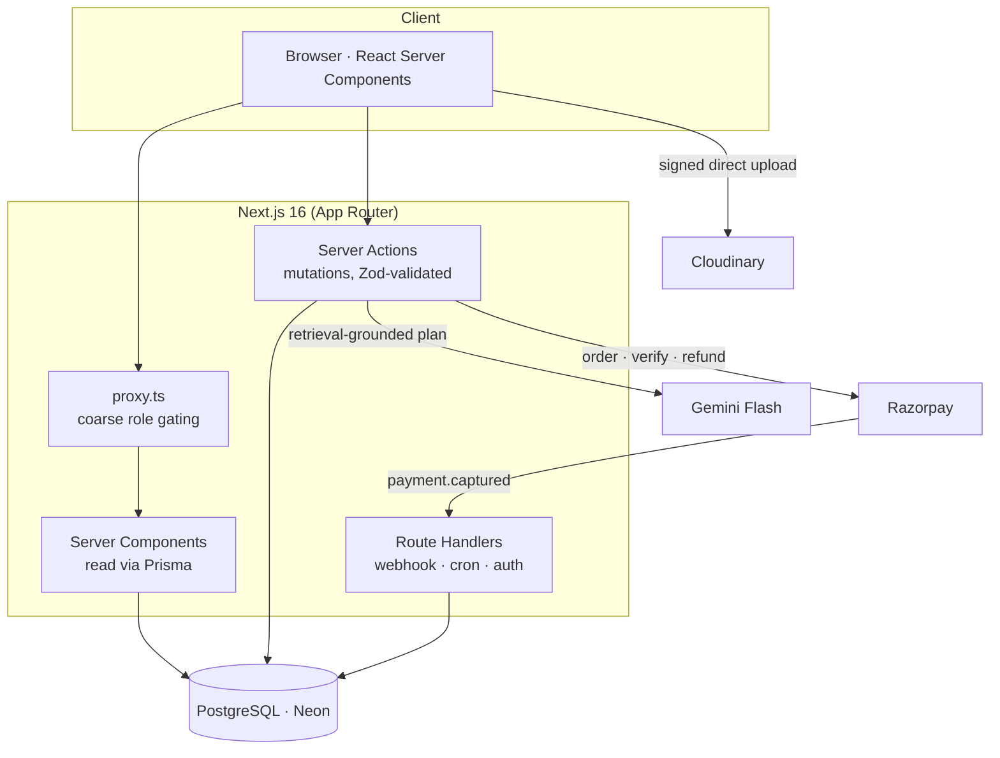

# RiRoam

**Roam the land of high passes.** RiRoam is a Ladakh-first travel marketplace —
book verified tour packages, hotels & homestays, and taxis & bikes, with a
data-grounded AI trip planner.

> **ri (རི)** means _mountain_ in Ladakhi/Tibetan — RiRoam is _mountain roam_.
> La-dags ≈ _land of high passes_.

Altitude is a first-class element of the product: every listing carries a
mono-font altitude chip, and package itineraries render as a day-by-day
elevation profile with acclimatization days shaded.

## What it does

- **Three-role platform** — tourists browse and book; vendors list packages,
  hotels and vehicles and manage bookings; admins approve vendors and moderate.
- **Real booking engine** — availability with overlap-aware date math, a
  row-locked transaction that prevents double-booking, a 20-minute payment hold
  with lazy expiry, and Razorpay order creation + HMAC verification + webhook.
- **Server-computed money** — prices and refunds are always recomputed on the
  server (integer paise, never floats); extras are price-snapshotted at booking
  time so later price changes don't rewrite history.
- **Grounded AI planner** — retrieval over real listings → schema-constrained
  Gemini generation → validation that drops any hallucinated id, so every
  suggested day links to a real, bookable listing.
- **Reviews from completed trips only** — enforced by a unique constraint on the
  booking, with denormalized ratings kept correct in the same transaction.

## Architecture



Authorization is defense-in-depth: `proxy.ts` does fast JWT role gating for UX,
but every mutation and protected layout re-checks the database (`requireVendor`
/ `requireAdmin`), so a stale token is never a security boundary.

## Stack

| Layer      | Choice                                             |
| ---------- | -------------------------------------------------- |
| Framework  | Next.js 16 (App Router) + TypeScript               |
| Database   | PostgreSQL (Neon) + Prisma 6                        |
| Auth       | Auth.js v5 — Credentials + Google, JWT sessions    |
| UI         | Tailwind CSS v4 + shadcn/ui                         |
| Validation | Zod + react-hook-form                              |
| Payments   | Razorpay (test mode)                               |
| Uploads    | Cloudinary                                          |
| AI         | Google Gemini (Flash) via `@google/genai`          |
| Email      | Resend + React Email                               |
| Maps       | Leaflet + OpenStreetMap                            |

## Getting started

```bash
# 1. Install
npm install

# 2. Configure — copy the example and fill in your values
cp .env.example .env

# 3. Apply the schema to your database
npm run db:migrate

# 4. Seed demo data (admin from .env + vendors, listings, bookings, reviews)
npm run db:seed

# 5. Run
npm run dev
```

Open [http://localhost:3000](http://localhost:3000).

### Demo accounts

The seed populates a full Ladakh dataset — four vendors (one left pending so the
approval queue has content), six packages with itineraries, four stays, six
vehicles, and completed bookings with reviews.

| Role   | Email                     | Password        |
| ------ | ------------------------- | --------------- |
| Admin  | _from `ADMIN_SEED_EMAIL`_ | _your value_    |
| Vendor | `julley@example.com`      | `riroam-vendor` |
| Tourist| `ankit@example.com`       | `riroam-demo`   |

## Scripts

| Script                | Does                                    |
| --------------------- | --------------------------------------- |
| `npm run dev`         | Start the dev server                    |
| `npm run build`       | Production build                        |
| `npm run db:migrate`  | Create & apply a Prisma migration       |
| `npm run db:seed`     | Seed the database                       |
| `npm run db:studio`   | Open Prisma Studio                      |
| `npm run db:reset`    | Drop, re-migrate, and re-seed           |

## Project layout

```
prisma/           schema + migrations + seed
src/
  app/            routes (App Router)
  actions/        server actions, one file per domain
  components/     ui · shared · tourist · vendor · admin
  lib/            auth, prisma, validators, and domain helpers
  types/          shared types + module augmentation
```
